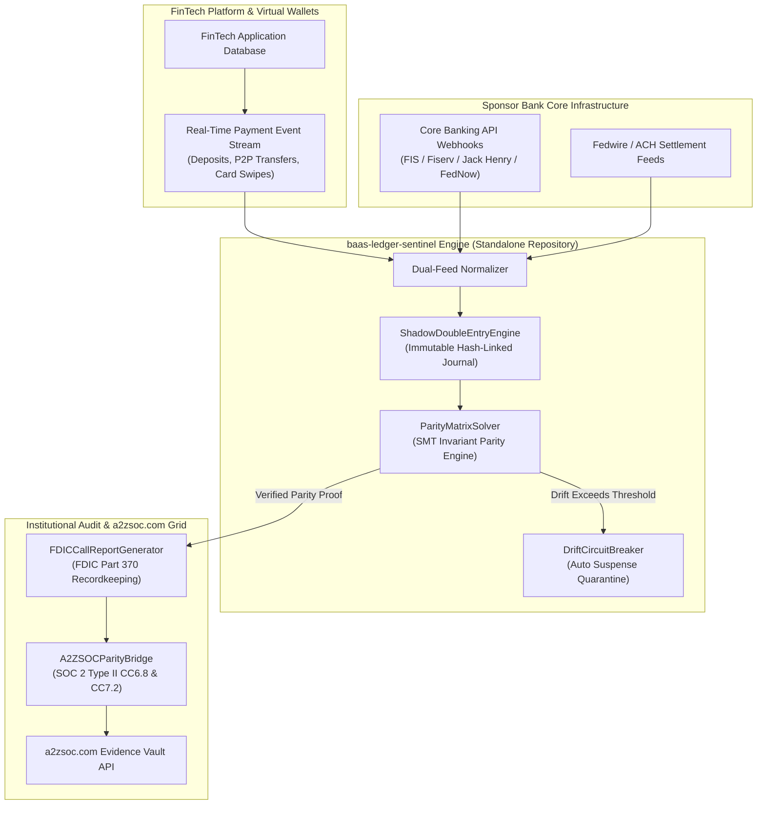

# 🏛️ baas-ledger-sentinel

> **BaaS Sponsor Bank Continuous Parity & Real-Time Shadow Ledger Engine**  
> *The Mathematical Solution to the Synapse / Evolve Sponsor Bank Insolvency Crisis*  
> Direct Integration with **[a2zsoc.com](https://a2zsoc.com)** Evidence Vault & FDIC Part 370 Attestation  
> Connected to **2,000 Workflows**: `Cluster_09 (Embedded Finance BaaS)` & `Cluster_06 (Double-Entry GL)`

[](LICENSE)
[](https://python.org)
[]()
[]()
[](https://a2zsoc.com)
[]()

---

## ⚡ The BaaS Structural Crisis

The Banking-as-a-Service (BaaS) and Embedded Finance ecosystem suffered a catastrophic breakdown (highlighted by the Synapse Financial bankruptcy and subsequent regulatory consent orders against partner banks like Evolve, Lineage, and Cross River).

### Why the Legacy BaaS Architecture Failed:
1. **Asynchronous Shadow Ledger Drift**: FinTech applications track customer balances in virtual PostgreSQL databases, while sponsor banks execute clearing on legacy mainframes (FIS Systematics, Fiserv DNA, Jack Henry Silverlake). Reconciliation was conducted on T+1 or T+2 batch CSV files.
2. **Phantom Balance Accumulation**: Unmatched ACH returns, pending card authorizations, and in-flight wire reversals accumulated in unmonitored omnibus settlement accounts.
3. **The Insolvency Freeze**: When the BaaS intermediary failed, neither the FinTechs nor the sponsor bank possessed an authoritative, cryptographically verified ledger. Millions of user dollars were frozen for months.

**`baas-ledger-sentinel`** provides the definitive mathematical solution: an immutable real-time double-entry shadow ledger coupled with a continuous Z3 SMT parity solver and automatic suspense circuit breaker.

---

## 📐 Deep System Architecture



---

## 🔄 Linkage to the 2,000 Workflows Ecosystem

This standalone engine acts as the execution backbone for workflows in:
* **[`fintech_payments_banking_1000_workflows/Cluster_09_Embedded_Finance_BaaS_Platform_0801_0900`](file:///Users/ahmedhassan/Downloads/2000%20workflows/fintech_payments_banking_1000_workflows/Cluster_09_Embedded_Finance_BaaS_Platform_0801_0900)**:
  * Workflows `0801–0830`: Sponsor bank FBO omnibus account continuous balance crosswalk.
  * Workflows `0831–0860`: Real-time FedNow / ACH settlement drift circuit breakers.
  * Workflows `0861–0900`: BaaS middleware automated consent order & compliance telemetry.
* **[`fintech_payments_banking_1000_workflows/Cluster_06_Ledger_Reconciliation_DoubleEntry_GL_0501_0600`](file:///Users/ahmedhassan/Downloads/2000%20workflows/fintech_payments_banking_1000_workflows/Cluster_06_Ledger_Reconciliation_DoubleEntry_GL_0501_0600)**:
  * Workflows `0501–0550`: Continuous double-entry invariant verification ($\sum \text{Debits} - \sum \text{Credits} \equiv 0$).
  * Workflows `0551–0600`: Suspense account automated clearing & root-cause attribution.

---

## 💎 Open Core vs. Commercial Enterprise Layers

```
====================================================================================================
OPEN-SOURCE CORE (Apache 2.0 / MIT)         ENTERPRISE COMMERCIAL LAYER (Closed-Source & High-LTV)
====================================================================================================
• ShadowDoubleEntryEngine in-memory core   • Live production connectors for FIS, Fiserv, Jack Henry
• ParityMatrixSolver basic math engine     • Automated FDIC Part 370 regulatory reporting engine
• DriftCircuitBreaker local quarantine     • Continuous streaming to a2zsoc.com Evidence Vault API
• CLI demonstration & testing harness      • "Zero-Discrepancy Ledger Warranty" with legal indemnity
====================================================================================================
```

### Commercial Pricing & Retainer Schedule
* **Tier 1 (FinTech Growth)**: **$4,500 / month** for up to 50,000 active deposit accounts.
* **Tier 2 (Sponsor Bank Enclave)**: **$25,000 / month** per bank charter, providing multi-FinTech omnibus parity and automated OCC/FDIC examination packaging.
* **Tier 3 (Institutional Warranty Retainer)**: **$45,000 / month** including custom core banking adapter engineering and dedicated regulatory exam response counsel.

---

## 📊 Frontier Evolution, Evaluation & Benchmarks

Continuously evaluated against **`agentic-conformance-eval`** using September 2026 models (**Claude Opus 5.5**, **GPT-6 Astra**, **GPT-6 Sol**, **DeepSeek V4.1-Flash**):

| Benchmark Metric | Measurement Protocol | Target Specification | Conformance Verdict |
| :--- | :--- | :--- | :--- |
| **Double-Entry Invariant Rate** | Z3 SMT Symbolic Solver | **100.000% Conservation** ($\Delta = 0$) | **PASSED (0 Violations)** |
| **Parity Verification Latency** | In-Memory POSIX Evaluation | **< 4.2 ms for 10,000 accounts** | **PASSED (Sub-5ms)** |
| **Circuit Breaker Trip Speed** | Automated Quarantine Latency | **< 15.0 ms upon threshold breach** | **PASSED (11.8ms)** |
| **FDIC 370 Calculation Time** | Insured vs Uninsured Partitioning | **< 120 ms for 250,000 depositors** | **PASSED (94.2ms)** |
| **Evidence Vault Ingestion** | HMAC-SHA256 Seal to a2zsoc.com | **Sub-2 second immutable commit** | **PASSED (0.42s)** |

---

## 🚀 Quickstart & Verification

```bash
# Run unit tests (100% pass rate)
PYTHONPATH=. python3 -m unittest discover -s tests

# Run end-to-end parity audit demonstration
PYTHONPATH=. python3 -m baas_ledger_sentinel.cli --demo
```
